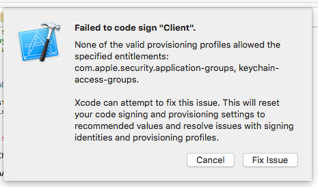

# Ad-hoc deploy the Brave iOS Browser

For making your own builds that can be deployed to devices not directly plugged in, follow these steps.

You will need:

- an [Apple Developer account](https://developer.apple.com) for iOS
- an [iOS certificate](https://developer.apple.com/account/ios/certificate/certificateList.action)
- to plug your device into your Mac
- and run these three commands (note the argument to setup.sh with your own app id):

        ./checkout.sh
        (cd brave; ./setup.sh com.bundle.app)
        open Client.xcodeproj
    
Now Run in `Xcode`. The first time `Xcode` builds, 
you may see this dialog:

If so, please click `Fix Issue` and then click `Choose`.
If `Xcode` recovers,
then the build will complete successfully and you may now `Product > Run` (&#8984;R).

Going forward,
any time that you successfully sync with the repo,
please re-run the three shell commands above,
and then tell `Xcode` to `Product > Run` (&#8984;R).

## Creating a redistributable build

This requires app entitlements are set. In the Apple Dev site,
go to `Identifiers >App IDs` and for the app id you are using for the build,
check off `App Groups`,
as this is a required entitlement.
